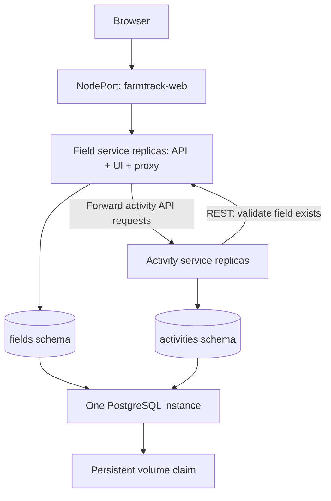

# FarmTrack: architecture and discussion

## Application and users

FarmTrack helps a farm operator record fields, their area and current crop, schedule watering, fertilizing and harvesting tasks, and mark tasks complete. The browser shows farm totals, field cards, activity filters, and task history. It deliberately excludes crop advice, payments, sensors, weather integrations and multi-user accounts.

## Component mapping

| Software component | Runtime microservice | Responsibility and storage |
|---|---|---|
| Field REST API and browser assets | Field service | Field records in the `fields` PostgreSQL schema |
| Browser-facing activity proxy | Field service | Fixed-path forwarding to the Activity REST API; no activity persistence |
| Activity REST API | Activity service | Tasks and completion timestamps in the `activities` schema |
| Relational persistence | PostgreSQL StatefulSet | Both schemas, backed by a persistent volume claim |
| External entry | Kubernetes NodePort Service | Routes browser requests to Field service replicas |
| Internal routing | Kubernetes ClusterIP Services | Stable DNS names and routing to healthy application pods |

## Architecture patterns

Microservices are decomposed by business capability. Services communicate through synchronous HTTP request-response with explicit timeouts. The Field service also implements a small backend-for-frontend proxy, keeping the browser on one origin. This is a deliberately combined role, not an independently deployed API gateway. Service instances are stateless and can scale horizontally. Kubernetes Services provide discovery and routing.

Data ownership is by schema inside a shared database instance. Application code never queries the other service's tables. This is not a fully isolated database-per-service deployment: a common database account is used, so separation is an application convention rather than enforced database authorization. Production improvements include separate least-privilege database users and a dedicated migration role.

## Creating a task

1. Browser sends `POST /api/activities` to the external Field service endpoint.
2. The fixed-route proxy forwards it to the Activity service.
3. Activity service validates types, permitted activity kind, date and note length.
4. Activity service calls Field service `GET /api/fields/{id}` with a three-second timeout.
5. Missing fields return 404. Network failures return 503 and no activity is inserted.
6. A valid task is committed in the activities schema and returned with HTTP 201.

No deletion endpoint is offered, so a field cannot be deleted between validation and task creation. Adding field deletion later requires a consistency policy. Task completion is idempotent: repeating PATCH preserves its original completion timestamp. POST creation is not idempotent; ambiguous timeouts could lead to duplicate tasks if manually retried. A production version should support idempotency keys. There is no unsafe automatic retry of writes.

## Benefits and business implications

Independent scaling lets a larger agricultural operator allocate more replicas to activity traffic during busy periods. Separate responsibilities make the code easier to understand and can support separate team ownership. Browser access avoids client installation. Container images and declarative Kubernetes resources make repeated deployments easier. Persistent storage protects records against ordinary pod restarts.

For a single small farm, these advantages probably do not justify Kubernetes and microservice operating costs. A modular monolith would usually be simpler. Pretend the system serves a large agricultural organization with many field workers and sharply seasonal activity traffic to justify this exercise. No cost savings or performance gains are claimed without measurements. More replicas add costs and can increase database connections; they do not automatically make the system faster.

## Challenges and mitigations

| Challenge | Present behavior | Further mitigation |
|---|---|---|
| Network latency and failures | Three-second validation and five-second proxy timeouts; clear 503 responses | Circuit breakers, tracing, latency monitoring |
| Shared database bottleneck/failure | One persistent PostgreSQL instance; brief restart outages expected | Backups, tested restore, connection pooling and managed HA database |
| Database startup races | Transaction-scoped advisory lock serializes schema creation | Versioned migrations run as a separate deployment step |
| Coupled browser routing | Activity UI requests pass through Field service | Separate gateway if traffic or availability requires it |
| Duplicate create requests | UI disables submit while saving; no automatic write retries | Durable idempotency keys |
| Unbounded history | List endpoints return all records; suitable for small demo | Pagination, indexes, retention policies |
| Deployment complexity | README, probes, resource requests and repeatable manifests | CI/CD, image scanning, rollback and observability |
| Storage durability | StatefulSet claim survives pod replacement | External durable storage, retention controls and off-cluster backups |

## Security

Implemented: Pydantic input validation, parameterized SQL, escaping user content before HTML insertion, fixed upstream proxy paths, no cross-origin browser requirement, non-root application containers, read-only application root filesystems, dropped Linux capabilities, disabled application service-account token mounting, Kubernetes Secret references, and a database with no external Service. Logs contain route/method/status/timing and generated request IDs, not credentials or request bodies.

Limitations: there is no authentication, role-based application authorization, HTTPS termination, rate limiting, network policy or CSRF defense tied to an authenticated session. The demo should run in a controlled lab. Before public production use, add identity and farm-level authorization, HTTPS, request limits, restrictive NetworkPolicies, secret rotation and encrypted secret storage. Kubernetes Secrets are not automatically encrypted merely because values are base64 encoded. The shared PostgreSQL account created by the standard container has broad privileges; separate least-privilege roles are a priority. Internal database traffic is not configured for TLS. Container and dependency versions must be scanned and maintained; version pins alone are not a security guarantee.

Liveness does not query the database, so a database outage does not trigger unnecessary application restarts. Readiness does query the database so unhealthy replicas are removed from service routing. Activity readiness does not depend on Field availability: listing and completing existing tasks can still work through direct internal API access while field validation is unavailable. Browser access still depends on the Field service.

## Assignment mapping

| Requirement | Implementation / evidence needed |
|---|---|
| Kubernetes deployable | `k8s/` manifests; live deployment still to demonstrate |
| Two types of application service plus database | Field service, Activity service, PostgreSQL |
| REST APIs | Both FastAPI apps, each with `/docs` |
| Programmatic API consumption | Browser fetch calls; Activity-to-Field HTTP call |
| External access | NodePort plus documented local port-forward fallback |
| Independent horizontal scaling | Separate Deployments; scale commands in README |
| Docker Hub images | Two Dockerfiles and publishing script; user must publish real images |
| Separate database service | PostgreSQL StatefulSet and internal Service |
| Persistent database storage | StatefulSet PVC; actual backend durability must be demonstrated |

## AI assistance

This project was generated with AI assistance. Check the course policy and provide the disclosure it requires. Review and understand the implementation, run the deployment yourself, and replace proposed evidence with your actual results. This document does not claim that remote publication or Kubernetes execution has occurred.
